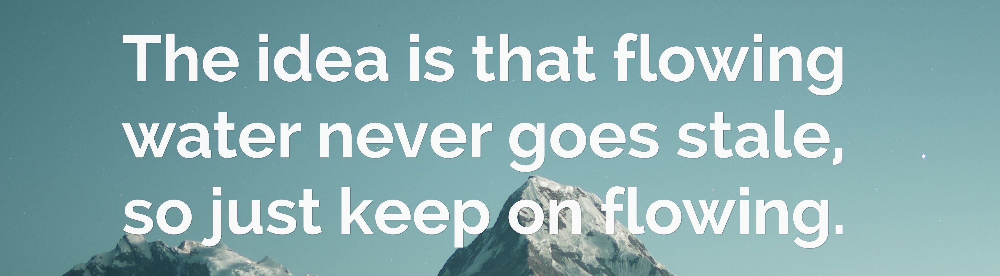

### Namaskara 🙏🏼
#### ನಾನೊಬ್ಬ ಕನ್ನಡಿಗ

 
 

I am a **Gator** 🐊 pursuing a masters in Computer and Information Science from **University of Florida**. Passionate about design and implementation of distributed systems and applications. A combination of **Software Engineering, Big Data and Machine Learning** is my field of interest. I am a hobby sailor ⛵️, traveller 🗺 and I 🧡 cultural anthropology. I believe in (**1.01**)**365** **= 37.78**. 

**My journey:**

- 👨🏽‍💻 I worked as a Data Engineer with [Jio Platforms](https://www.jio.com/)
- 🌱 I am currently learning Analysis of Algorithms, Databases, Distributed Systems and Frontend Development;
- 🤔 My interests are Algorithms/Data Structures, Distributed Systems, Databases, Software Engineering, Machine Learning;
- 📫 Drop mails at anmollp@gmail.com.

**Languages and Tools:**  

<code></code>
<code></code>
<code></code>
<code></code>
<code></code>
<code></code>
<code></code>
<code></code>
<code></code>

 \

   

